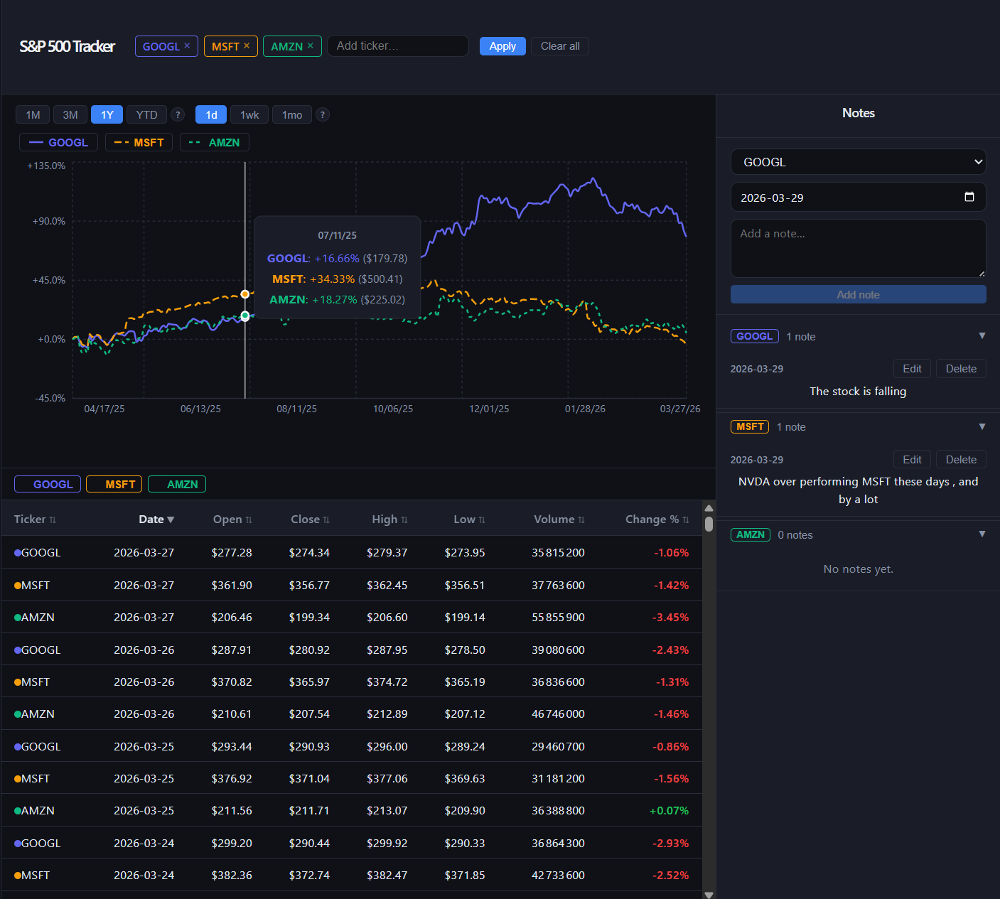

# S&P 500 Tracker

A full-stack web app for tracking and analyzing S&P 500 stock data. Select up to 5 tickers simultaneously, compare price performance on an interactive chart, explore OHLCV data in a sortable table, and annotate observations with date-tagged notes.



The project was built incrementally across [13 ordered tasks](.docs/tasks/).

## Setup & Run

### Backend

Requires Python 3.10+.

**With [`uv`](https://github.com/astral-sh/uv) (recommended):**
```bash
cd backend
uv venv
source .venv/bin/activate   # Windows: .venv\Scripts\activate
uv pip install -r requirements.txt
uvicorn main:app --reload --port 8000
```

**With standard pip:**
```bash
cd backend
python3 -m venv .venv
source .venv/bin/activate   # Windows: .venv\Scripts\activate
pip install -r requirements.txt
uvicorn main:app --reload --port 8000
```

API available at `http://localhost:8000`. Docs at `http://localhost:8000/docs`.

### Frontend

Requires Node 18+.

```bash
cd frontend
npm install
npm run dev
```

App available at `http://localhost:5173`.

## Features

- **Multi-ticker chart** — select up to 5 S&P 500 tickers, compare % change from a common baseline with distinct line styles per ticker; click-drag to zoom
- **Sortable table** — OHLCV + Change% for all selected tickers, per-ticker filter toggles
- **Notes** — add, edit, delete date-tagged notes per ticker; grouped by ticker with collapsible sections
- **Date range presets** — 1M / 3M / 1Y / YTD with 1d / 1wk / 1mo granularity
- **Auto-refresh** — prices poll every 60 seconds

## Assumptions & Decisions

**React over Next.js** — less setup overhead; a full SSR framework adds complexity with no benefit for a local single-user tool.

**Top 10 tickers only** (AAPL, MSFT, NVDA, AMZN, GOOGL, META, BRK-B, TSLA, UNH, JPM) — yfinance imposes rate limits; a larger universe would require a paid data provider or more aggressive caching.

**Data frequency capped at daily (1d)** — yfinance via `yf.download()` does not provide intraday historical data for free. The finest granularity available is daily OHLCV. Intraday data would require a paid provider (Alpaca, Polygon.io).

**yfinance mitigations** — uses bulk `yf.download()` rather than looping individual `Ticker()` calls to reduce request overhead. Fetches are also serialized (yfinance is not thread-safe; concurrent calls corrupt OHLCV data between tickers). Try/catch with retry+backoff guards all calls.

**In-memory TTL cache (60s)** — avoids redundant yfinance calls within a session. Cache is lost on server restart, which is acceptable given the stateless nature of price data.

**SQLite over PostgreSQL** — zero infrastructure setup; acceptable for a single-user tool. Notes persist across restarts in `backend/stock_tracker.db`.

**% change normalization on the chart** — raw prices make multi-ticker comparison meaningless (e.g. BRK-B at ~$500 vs NVDA at ~$90). Normalizing to % change from the first data point puts all tickers on a common scale — the industry standard (Google Finance, Bloomberg).

**Notes: 1-to-1 per ticker+date** — one note maps to one ticker and one date. A many-to-many model (one note tagging multiple tickers) was considered but deemed out of scope; implementable with a `note_tickers` junction table.

**No authentication** — single-user local tool; auth would add complexity with no benefit here.

## Process & Reflection

### Process

The goal was to ship a working MVP fast. I front-loaded planning — drafted the architecture and ordered tasks by critical path (backend foundations → API layer → frontend) before writing a single line of code. This avoided integration surprises later.

Key decisions and tradeoffs:
- **Top 10 tickers instead of 500** — yfinance rate limits made a full universe impractical without a paid data provider or a proper ingestion pipeline
- **SQLite** — zero infrastructure overhead; acceptable for a single-user local tool
- **yfinance sequential fetching** — discovered mid-implementation that yfinance is not thread-safe; concurrent calls corrupted OHLCV data between tickers, so fetches are serialized
- **In-memory TTL cache** — simple 60s cache avoids hammering yfinance on every interaction; good enough for a demo, not for production
- **% change normalization** — raw prices make multi-ticker chart comparison meaningless (BRK-B at ~$500 vs NVDA at ~$90); normalizing to % change from the first data point solves this cleanly
- **AI bonus deferred** — would have required API key setup and added scope; prioritized a solid core experience first

### Reflections

The workflow was smooth — planning, then executing task by task with validation at each step kept things on track under time pressure. The app is functional and covers all four requirements.

That said, I would have liked more time to review the generated code more carefully, write tests, and make more deliberate architectural choices rather than optimizing purely for delivery speed. My backend experience is primarily with Express; FastAPI was new to me, so I leaned more heavily on assistance for the Python/async patterns than I would have on a familiar stack.

### What I'd Do Differently

With more time:
- **AI integration** — Claude API for natural language queries ("which ticker dropped most when COVID hit?"), translating them into chart filters or date range selections
- **TypeScript** — would catch a class of bugs at compile time that are currently silent
- **Tests** — pytest for the backend service layer (cache, fetch logic), Vitest for the React hooks
- **SSE / real-time** — replace 60s polling with server-sent events for live price ticks
- **PostgreSQL + proper data pipeline** — replace SQLite and yfinance with a real ingestion pipeline for a production-grade setup
- **Docker setup** — single `docker compose up` instead of two separate terminal sessions
- **Responsive layout** — current CSS grid is desktop-only
